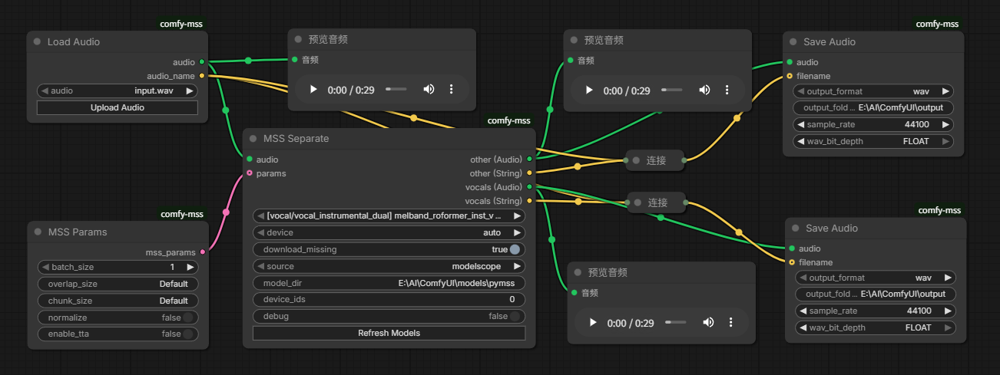

<h1 align="center">Comfy-MSS</h1>
<div align="center">
    ComfyUI custom nodes for <a href="https://pypi.org/project/pymss/">pymss</a>, a Python music source separation package.<br>
    <br>
    
</div>

## Nodes

- `MSS Separate`: separates a ComfyUI `AUDIO` stream with catalog MSS/non-VR pymss models.
- `Custom MSS Separate`: separates audio with user-provided MSS models from the custom model folder.
- `VR Separate`: separates a ComfyUI `AUDIO` stream with VR/UVR pymss models.
- `MSS Params`: optional parameter input for `MSS Separate` and `Custom MSS Separate`.
- `VR Params`: optional parameter input for `VR Separate`.
- `Load Audio`: loads one audio file and outputs both the audio stream and the file name without extension.
- `Load Audio Batch`: loads audio files from a folder as ComfyUI list outputs.
- `Audio Invert Phase`: inverts audio input `a` and outputs `-a`.
- `Audio Normalize`: normalizes only when the peak is above 0 dBFS.
- `Audio Ensemble`: combines 2 to 10 audio inputs with selectable ensemble algorithms and weights.
- `Save Audio`: saves ComfyUI `AUDIO` streams as `wav`, `flac`, or `mp3`.

## Installation

Clone or download this repository, put it into your ComfyUI `custom_nodes` folder. The custom nodes load automatically when you start ComfyUI. Make sure to install `pymss` in the same Python environment as ComfyUI. Or you can use `comfyui_manager` to install this custom node.

```bash
ComfyUI/custom_nodes
        └──comfy-mss
            ├── comfy_mss
            ├── web
            ├── nodes.py
            └── ...
```

### Project Structure

- `comfy_mss`: main package folder.
- `web`: frontend files.
- `examples`: example ComfyUI workflows.
- `nodes.py`: defines custom nodes.
- `requirements.txt`: Python dependencies.

## Separation Nodes

### Model Folder

Model files default to: `ComfyUI/models/pymss`. The folder is created automatically when the custom node loads.

The separator nodes do not expose model folder widgets, so shared workflows do not contain machine-specific model paths. The model folder can be changed with environment variables:

- `COMFY_MSS_MODEL_DIR`
- `PYMSS_MODEL_DIR`

You can also configure an extra ComfyUI model path by copying `extra_model_paths.yaml.example` to `extra_model_paths.yaml` and adding an independent pymss config group:

```yaml
comfy-mss:
  base_path: path/to/your/model/root/
  pymss: models
```

The outer `comfy-mss` is only the config group name. The inner `pymss` is the actual ComfyUI model folder key used by comfy-mss. With the example above, the final model folder is `path/to/your/model/root/models`.

You can also use an absolute path directly:

```yaml
comfy-mss:
  pymss: E:/AI/Models/pymss
```

If multiple `pymss` model folders are registered, comfy-mss scans them when checking whether catalog models are already downloaded. Downloads use the default `pymss` folder.

### MSS/VR Separate

`MSS Separate` and `VR Separate` inputs:

- `audio`: ComfyUI `AUDIO`.
- `model_name`: pymss catalog model name.
- `device`: `auto`, `cpu`, `cuda`, `mps`, or `mlx`.
- `download_missing`: defaults to `true`.
- `source`: `modelscope`, `huggingface`, or `hf-mirror`.
- `params`: optional params node output.
- `device_ids`: defaults to `0`.
- `debug`: prints pymss debug and timing information when enabled.

### Custom MSS Separate

`Custom MSS Separate` scans the custom model folder, which defaults to: `ComfyUI/models/pymss/custom`. The folder is created automatically. Custom model files must be paired with a same-name YAML config in the same folder, for example:

```text
my_model.ckpt
my_model.yaml
```

Config files must use `.yaml`. The node reads `training.instruments` from the YAML to determine dynamic stem outputs:

```yaml
training:
  instruments:
    - Vocals
    - Instrumental
```

`Custom MSS Separate` inputs:

- `audio`: ComfyUI `AUDIO`.
- `model_name`: detected custom model pair.
- `model_type`: pymss architecture type, such as `mel_band_roformer`, `bs_roformer`, `mdx23c`, or `htdemucs`.
- `device`: `auto`, `cpu`, `cuda`, `mps`, or `mlx`.
- `params`: optional `MSS Params` output.
- `device_ids`: defaults to `0`.
- `debug`: prints pymss debug and timing information when enabled.

Click `Refresh Models` after adding, removing, or changing custom model files. If no valid custom model pair exists, the node hides unused stem outputs.

## Params Nodes

### MSS Params

- `batch_size`: defaults to `1`.
- `overlap_size`: defaults to `Default`.
- `chunk_size`: defaults to `Default`.
- `normalize`: defaults to `false`.
- `enable_tta`: defaults to `false`.
- `standardize`: defaults to `false`.

`Default` for `overlap_size` and `chunk_size` means the selected model's YAML values are used. Enter a positive integer to override either value.

`normalize` enables pymss output peak normalization. `standardize` enables pymss MSS input standardization.

### VR Params

- `batch_size`: defaults to `1`.
- `window_size`: defaults to `512`.
- `aggression`: defaults to `5`.
- `enable_tta`: defaults to `false`.
- `high_end_process`: defaults to `false`.
- `enable_post_process`: defaults to `false`.
- `post_process_threshold`: defaults to `0.2`.
- `normalize`: defaults to `false`.

## Audio Nodes

### Load Audio

`Load Audio` is based on ComfyUI's built-in audio loader, but it also outputs `audio_name`, the selected file name without extension. The frontend adds the same upload button behavior as the official loader.

### Load Audio Batch

`Load Audio Batch` inputs:

- `folder`: folder path.
- `recursive`: scan subfolders when enabled.
- `sort_files`: sort matched files by path when enabled.

Relative folder paths are resolved from ComfyUI's input folder. Absolute paths are used directly.

`Load Audio Batch` outputs:

- `audio`: list of ComfyUI `AUDIO` objects.
- `audio_name`: list of loaded file names without extension.

Normal downstream ComfyUI nodes execute once per loaded list item, which is useful for batch separation workflows.

### Audio Invert Phase and Normalize

`Audio Invert Phase` multiplies the waveform by `-1`.

`Audio Normalize` checks the peak level. If the peak is above `1.0`, it scales the audio to `0.999`; otherwise it leaves the audio unchanged.

### Audio Ensemble

`Audio Ensemble` inputs:

- `input_count`: dynamically selects 2 to 10 audio inputs.
- `ensemble_type`: `avg_wave`, `median_wave`, `min_wave`, `max_wave`, `avg_fft`, `median_fft`, `min_fft`, or `max_fft`.
- `audio_1` to `audio_10`: dynamic audio inputs.
- `weight_1` to `weight_10`: dynamic numeric weights, defaulting to `1`.

Only the selected number of audio inputs and matching weights are shown. The ensemble algorithms are delegated to pymss' native ensemble implementation.

### Save Audio

`Save Audio` is an output node. It saves audio directly and does not need a downstream node.

Inputs:

- `audio`: ComfyUI `AUDIO`.
- `output_format`: `wav`, `flac`, or `mp3`.
- `output_folder`: defaults to `Default`, which saves into ComfyUI's output directory.
- `sample_rate`: `32000`, `44100`, or `48000`; defaults to `44100`.
- `filename`: optional forced text input. Connect a composed file name such as `audio_name + "_" + stem_name`.

Save behavior:

- `output_folder` set to `Default` or left empty: save into ComfyUI's default output folder.
- Relative `output_folder`: create/use that folder inside ComfyUI's output folder.
- Absolute `output_folder`: use that folder directly.
- If `filename` is not connected or is empty, saved files fall back to `audio_YYYYMMDD_HHMMSS`.
- Existing files are not overwritten. If a target path already exists, comfy-mss appends a numeric suffix.

Format-specific options are shown dynamically:

- `wav`: `FLOAT`, `PCM_24`, `PCM_16`
- `flac`: `PCM_24`, `PCM_16`
- `mp3`: `128k`, `192k`, `256k`, `320k`

## Contributions

Contributions are welcome! Please open an issue or submit a pull request.
